# Action4D

by [Quanzeng You](http://cs.rochester.edu/u/qyou/), [Hao Jiang](http://hao-jiang.net)

This is the code and data repository for our work **Action4D: Online Action Recognition in the Crowd and Clutter** published in **CVPR** 2019. 

### Introduction
We propose to tackle action recognition using a holistic 4D “scan” of a cluttered scene to include every detail
about the people and environment. In this work, we tackle a new
problem, i.e., recognizing multiple people’s actions in the
cluttered 4D representation.
Our method is invariant to
camera view angles, resistant to clutter and able to handle crowd.

### Methods

#### 1. Holistic "scan" of a clustered scene from multiple depth cameras.
We capture the whole scene using multiple depth cameras. Then, we reconstruct a holistic scene by fusing multiple calibrated depth images. The following figure shows an example.

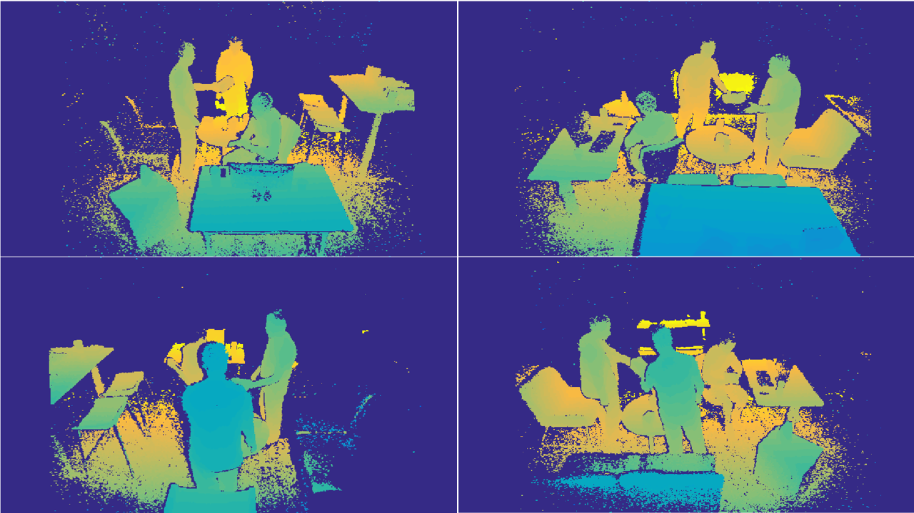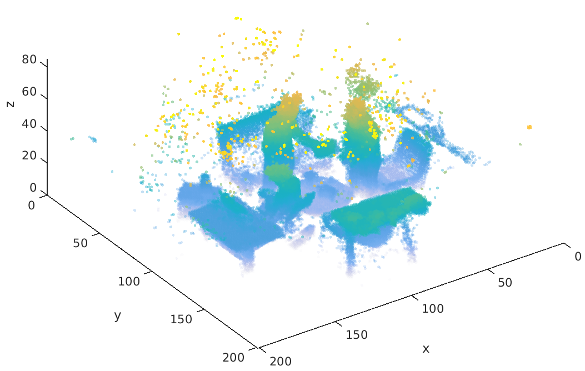


#### 2. Multiple people tracking using top-down view

Our tracker works on the top-down view of the scene. The following figure shows some of our tracking results. We show different colors for different tracked person.

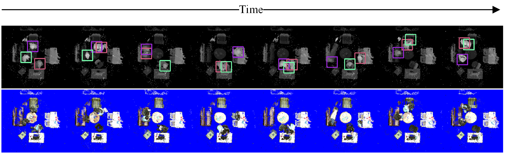

#### 3. Overall view of our online action recognition pipeline

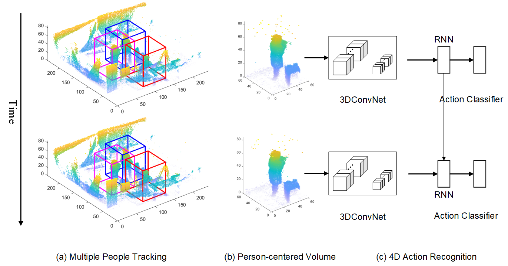

### Datasets

The cropped volumes of each subject has been shared in **data** folder. 

For test1 and test3, we also shared the training and validating file lists. 

All data files are saved using compressed npz format. The dataloader is going to load directly from the tar file into system memory. Please check the data_loader.py for details.


### Experiments

#### 1. Example snapshots of different actions

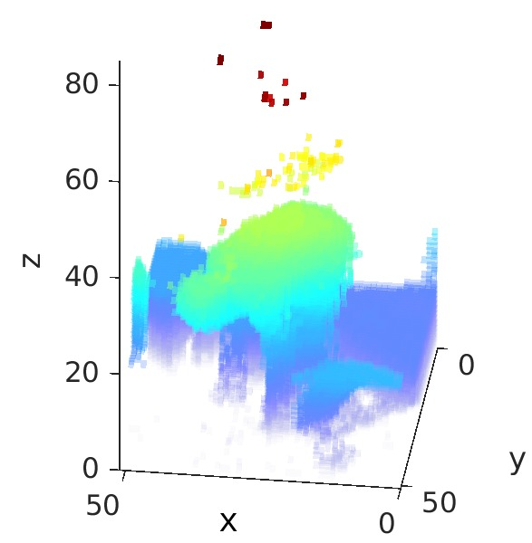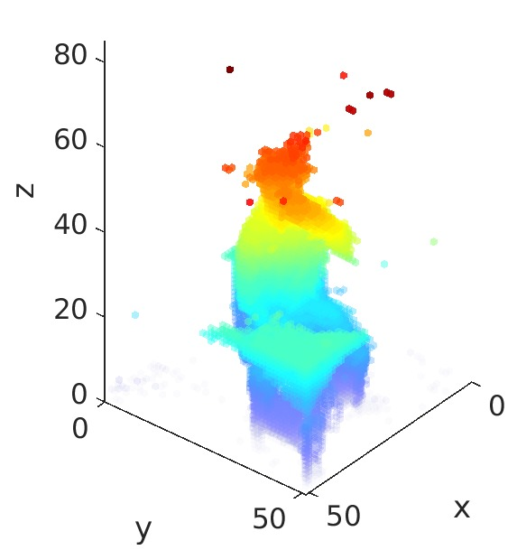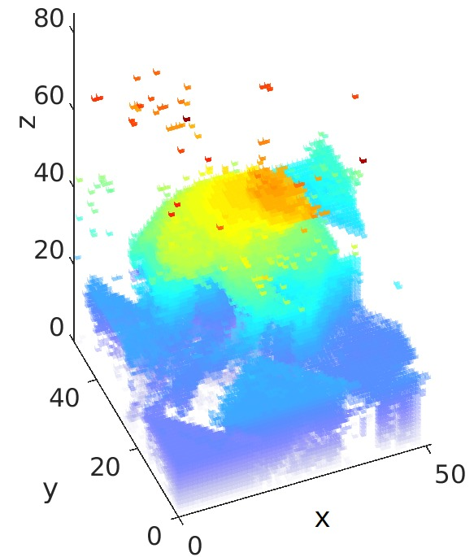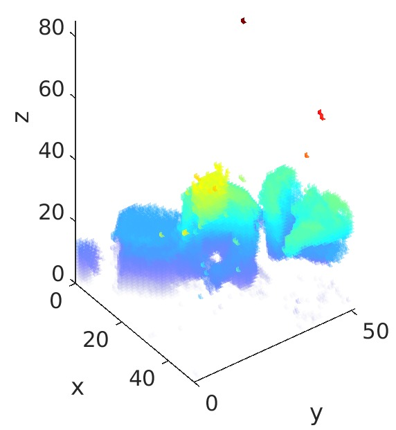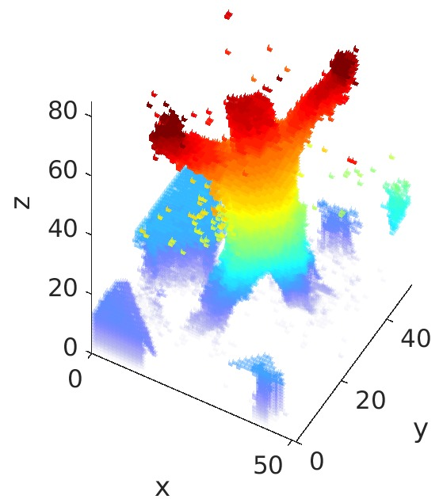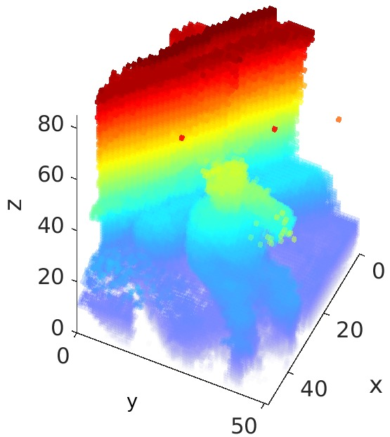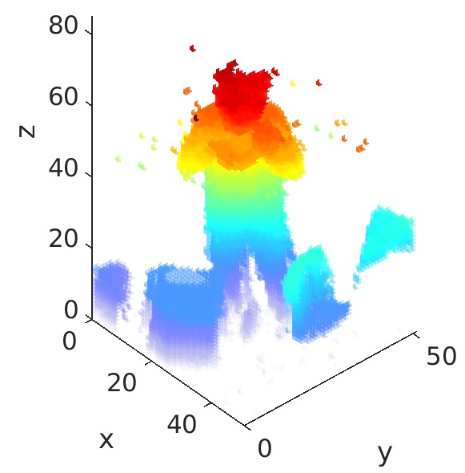
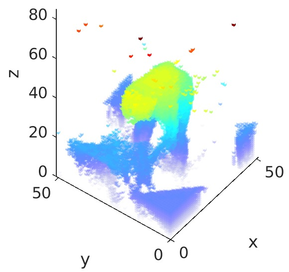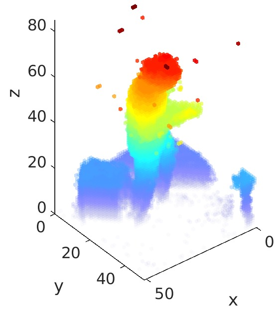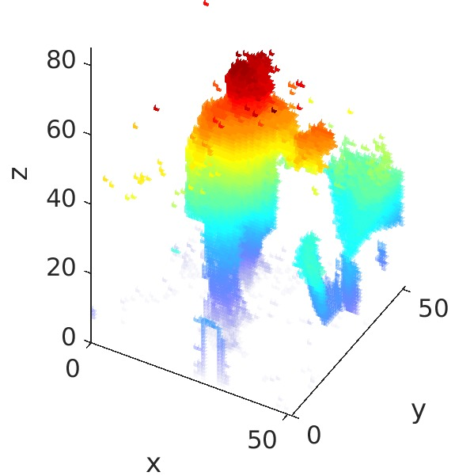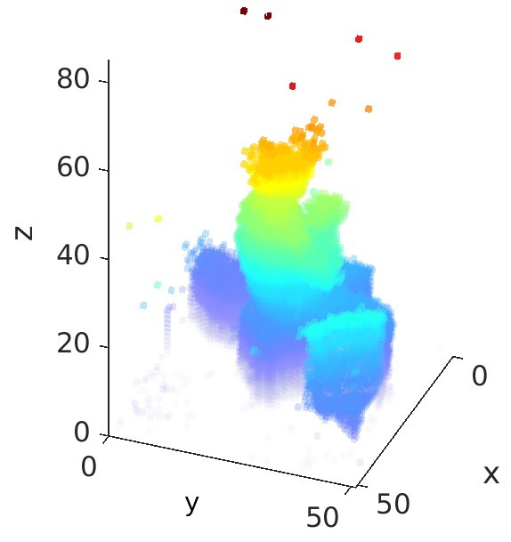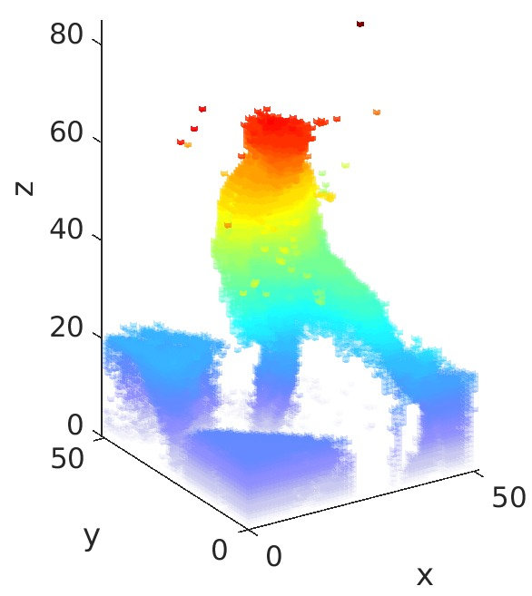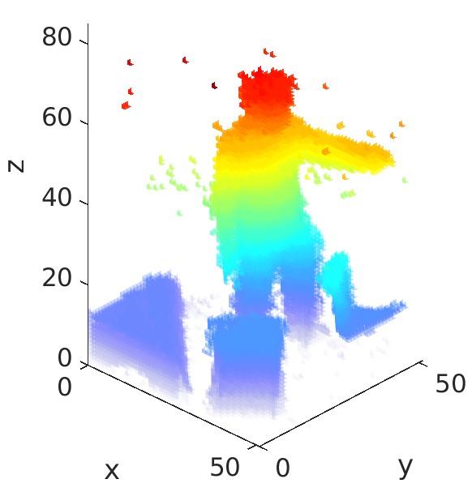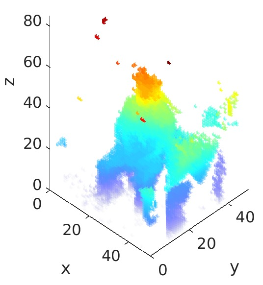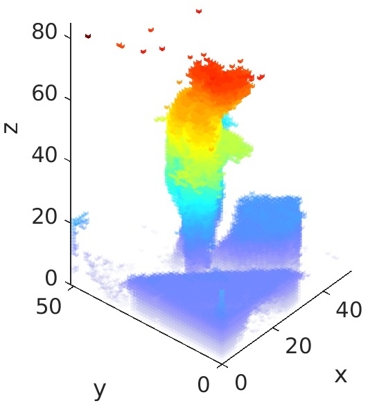

#### 2. Example of tracking multiple people and recognizing their actions

### Requirements
```
PyTorch >= 0.4.1
```

### Training and Testing


### Citation

    @InProceedings{action4d,
      author = {You, Quanzeng and Jiang, Hao},
      title = {Action4D: Online Action Recognition in the Crowd and Clutter},
      booktitle = {CVPR},
      year = {2019}
    }
