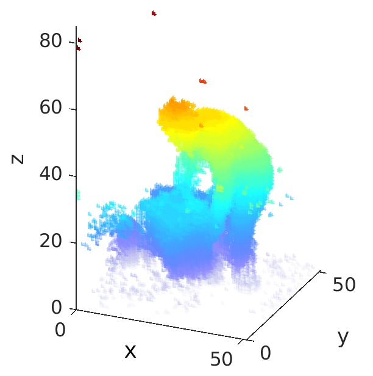

# Action4D

by [Quanzeng You](http://cs.rochester.edu/u/qyou/), [Hao Jiang](http://hao-jiang.net)

This is the code and data repository for our work ``Action4D: Online Action REcognition in the Crowd and Clutter'' published in CVPR 2019. 

### Introduction
We propose to tackle action recognition using a holistic 4D “scan” of a cluttered scene to include every detail
about the people and environment. In this work, we tackle a new
problem, i.e., recognizing multiple people’s actions in the
cluttered 4D representation.
Our method is invariant to
camera view angles, resistant to clutter and able to handle crowd.

#### Example snapshots of different actions




[](https://www.youtube.com/watch?v=KOxbO0EI4MA "Audi R8")
### Requirements
```
PyTorch >= 0.4.1
```
### Action4D Dataset

### Citation

    @InProceedings{action4d,
      author = {You, Quanzeng and Jiang, Hao},
      title = {Action4D: Online Action Recognition in the Crowd and Clutter},
      booktitle = {CVPR},
      year = {2019}
    }
